import YouTubeEmbed from "@site/src/components/YouTubeEmbed";
import Highlight from "@site/src/components/Highlight";

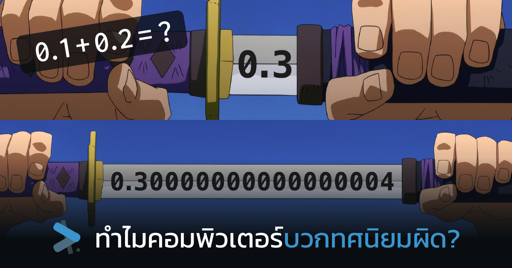

คอมพิวเตอร์ถูกคิดค้นมาเพื่อช่วยเราคำนวณเรื่องที่ซับซ้อน แต่ว่าแค่บวกทศนิยมหลักเดียวก็ยังผิดเลย แบบนี้จะเชื่อได้หรอ?

<!-- truncate -->

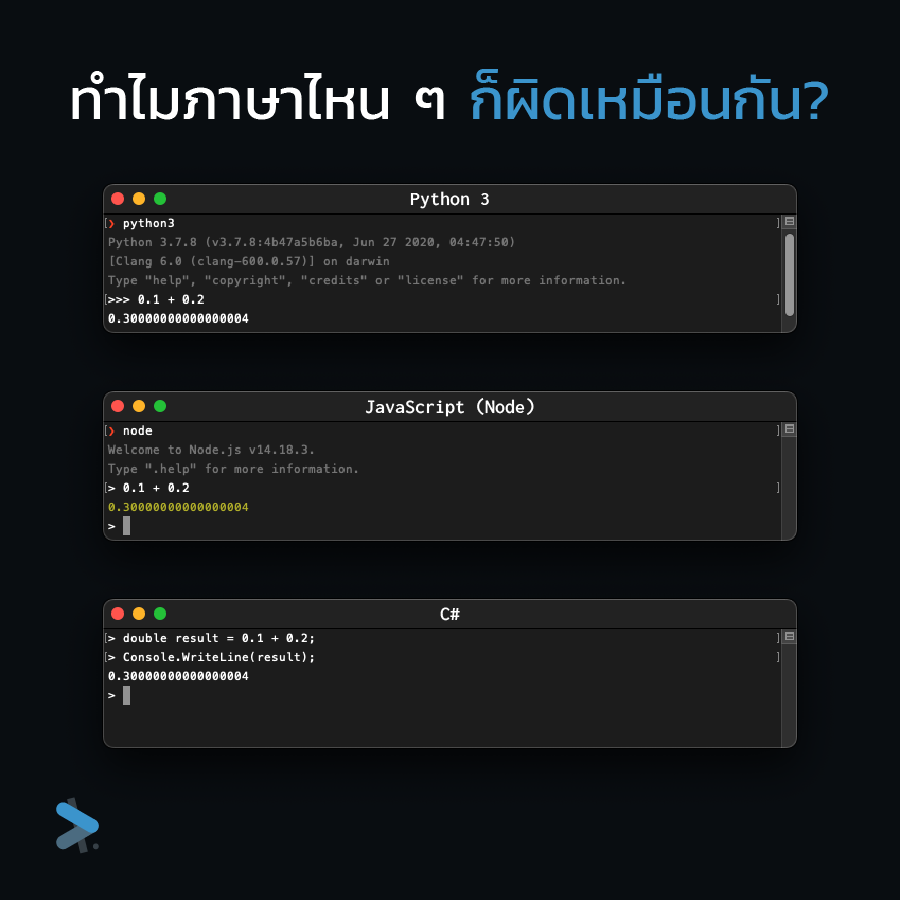

โจทย์ง่าย ๆ อย่าง 0.1 + 0.2 ที่ไม่ต้องพึ่งคอมพิวเตอร์ก็รู้ว่ายังไงมันก็ต้องเท่ากับ 0.3 แต่พอป้อนให้คอมพิวเตอร์ทำงานมันดันออกมาเป็น <Highlight>0.30000000000000004</Highlight> เฉย

ไม่ว่าจะลองเขียนในภาษาไหนก็ให้คำตอบเหมือนกันหมด แสดงว่ามันไม่ใช่ปัญหาที่ตัวภาษาแล้วแต่เป็นที่การทำงานของคอมพิวเตอร์เรา ว่าแต่มันเกิดจากอะไร แล้วเราจะแก้มันอย่างไรดี?

## ปัญหานี้ไม่ได้พบแค่ในคอมพิวเตอร์เท่านั้น!

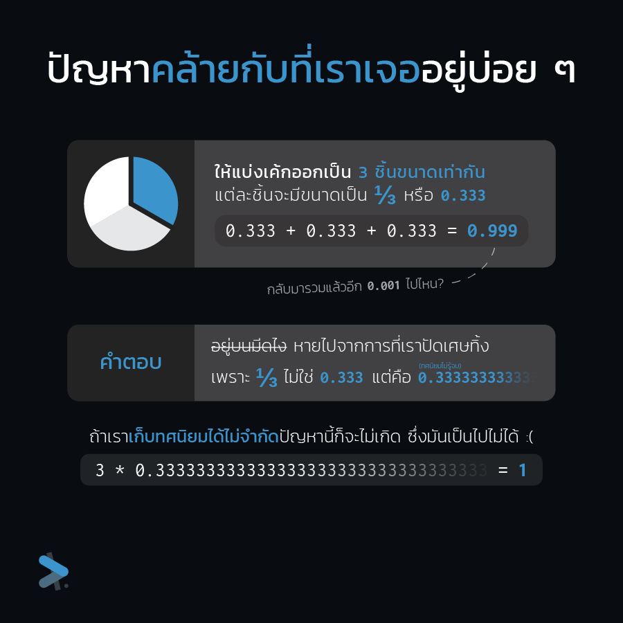

แต่ถ้าบอกว่าปัญหานี้ไม่ใช่แค่คอมพิวเตอร์ที่เจอเท่านั้น แต่มนุษย์อย่างเราเคยเจอเหมือนกัน

หลายคนน่าจะเคยได้ยินมุกสุดคลาสสิกที่ให้ตัดเค้กออกเป็น 3 ส่วนเท่า ๆ กัน พอนำกลับมารวมกัน (0.333 + 0.333 + 0.333 = 0.999) มันดันหายไปไหน 0.001 (ซึ่งตามมุกก็คือมันอยู่บนมีด)

ถ้าลองคิดตามดูก็จะเป็นเพราะว่าจริงแล้วมันเป็น **0.33333…** ไปเรื่อย ๆ ไม่รู้จบ แต่เราสนใจแค่ทศนิยม 3 หลักก็เลยปัดส่วนเกินทิ้งซึ่งก็เป็นเหตุให้ 0.001 ที่เราตามหาหายไป

แต่ถ้าเราเก็บทศนิยมได้ไม่จำกัดปัญหานี้ก็จะไม่เกิด เพราะเมื่อไม่ต้องปัดทิ้งก็จะไม่มีอะไรหายไป แต่มันก็เป็นไปไม่ได้ ซึ่งก็มาตรงกับกรณีเดียวที่คอมพิวเตอร์ที่ไม่สามารถเก็บทศนิยมไม่รู้จบให้เราได้จนต้องทำการปัดส่วนเกินไป

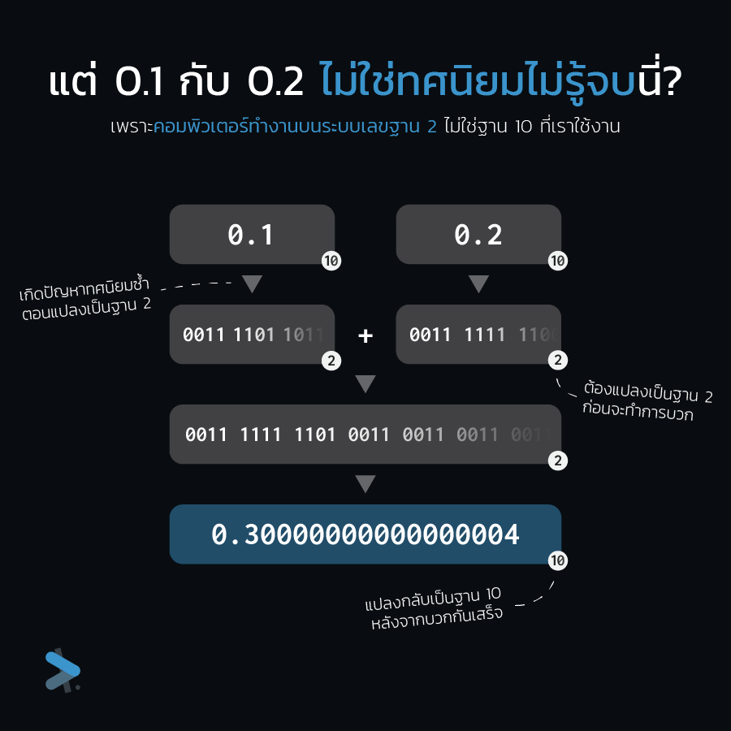

แต่ 0.1 กับ 0.2 ไม่ได้เป็นทศนิยมไม่รู้จบ ทำไมมันถึงมีปัญหาละ? อย่าลืมว่าคอมพิวเตอร์ไม่ได้รู้จักเลข 0-9 เหมือนกับเรา แต่รู้จักแค่ 0 กับ 1 ที่หมายถึงสถานะการปิด/เปิดบนวงจรเท่านั้น

ดั้งนั้นก่อนจะบวกให้เราได้นั้น จะต้องแปลงจากฐาน 10 เป็นฐาน 2 ก่อนซึ่งกระบวนการนี้ทำให้เกิดทศนิยมไม่รู้จบในระบบฐาน 2 จึงต้องมีการปัดทศนิยมเกิดขึ้น

เมื่อแปลงกลับมาเป็นฐาน 10 ก็จะได้ **0.30000000000000004** ที่คุ้นเคยจากความคลาดเคลื่อนในการปัดเศษ (rounding error)

## คอมพิวเตอร์เก็บตัวเลขอย่างไร?

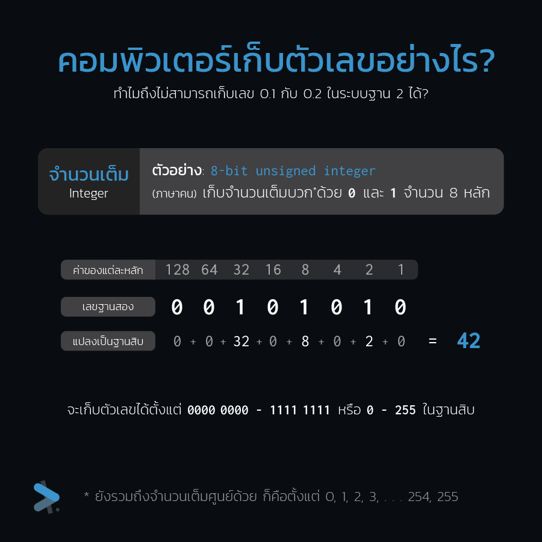

เจาะลึกลงไปที่การทำงานของคอมพิวเตอร์มาดูกันก่อนว่าจำนวนเต็ม (Integer) ถูกเก็บไว้อย่างไร?

ตามตัวอย่างคือ <Highlight block>8-bit unsigned integer</Highlight> ที่จะมีพื้นที่ให้เลข 0 กับ 1 จำนวน 8 หลัก ซึ่งจะทำให้เก็บจำนวนเต็มได้ตั้งแต่ 0 หรือเป็น 0 ทุกบิต (`0000 0000`) ไปจนถึง 255 หรือเป็น 1 ทุกบิต (`1111 1111`)

จำนวนเต็มสามารถระบุช่วงที่แน่นอนในการเก็บได้ อย่างเช่นถ้าแค่ 255 ไม่พอก็เพิ่มบิตไปเป็น **16-bit** ที่จะเก็บได้ตั้งแต่ 0-65,535 หรือถ้ายังไม่พออีกก็เพิ่มไปเป็น **32-bit** ที่จะเก็บได้ตั้งแต่ 0-4,294,967,295

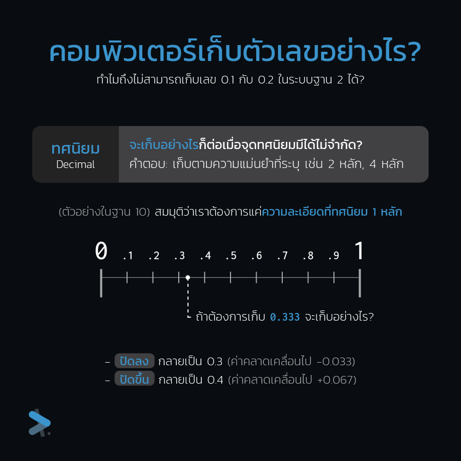

แต่พอมาดูที่ทศนิยมจะเก็บอย่างไรดี? เพราะว่าระหว่าง 0 ถึง 1 ก็มีทศนิยมได้ไม่จำกัดแล้ว

ในเมื่อมีความไม่จำกัดเข้ามาก็ต้องทำให้มันจำกัดได้โดยการเลือกว่าจะสนใจถึงแค่ทศนิยมหน่วยไหน เช่น หากสนใจแค่ตำแหน่งเดียวก็จะทำให้ระหว่าง 0-1 มีแค่ 11 ค่าก็คือ **0.0**, **0.1**, **0.2**, **0.3**, **0.4**, **0.5**, **0.6**, **0.7**, **0.8**, **0.9**, และ **1.0**

แต่คราวนี้เมื่อมีค่าที่ไม่อยู่ในความละเอียดที่เรารับได้อย่าง 0.333 เข้ามาจะเก็บอย่างไร? ก็มีอยู่สองตัวเลือกคือปัดลงให้กลายเป็น 0.3 หรือปัดขึ้นเป็น 0.4 แต่ไม่ว่าจะเลือกทางไหนก็ทำให้ค่าของเราคลาดเคลื่อนอยู่ดี

ในเมื่อเราเก็บทศนิยมไม่จำกัดไม่ได้ เมื่อมีค่าที่ไม่อยู่ในความละเอียดที่รับได้เข้ามา ก็ต้องมีการปัดเศษเกิดขึ้นเสมอ ไม่ว่าอย่างไรก็มีความคลาดเคลื่อนอยู่ดี

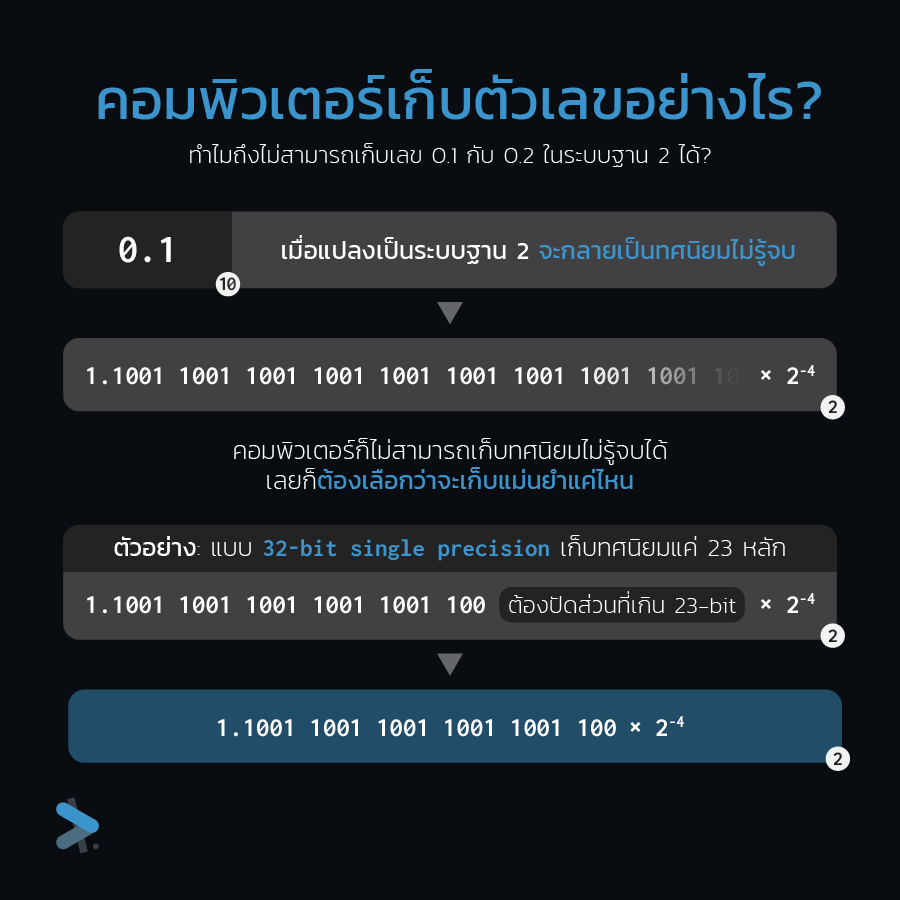

คราวนี้มาดูที่ระบบฐาน 2 บ้าง เมื่อเราป้อนเลข 0.1 ตัวปัญหานี้เข้าไป เมื่อจะทำการแปลงให้เป็นฐาน 2 คอมพิวเตอร์ของเราก็จะเจอกับทศนิยมไม่รู้จบ ซึ่งถ้าตัวเลขนี้เก็บในรูประดับความแม่นยำ **32-bit** ที่ใช้ 23 บิตในการเก็บทศนิยม ตอนที่ทำการแปลงหากครบ 23 บิตแล้วยังไม่เจอจุดจบของทศนิยม คอมพิวเตอร์ก็จะยอมแพ้แล้วก็ปัดทศนิยมไป

## เก็บแบบนี้แล้ว คลาดเคลื่อนเท่าไร?

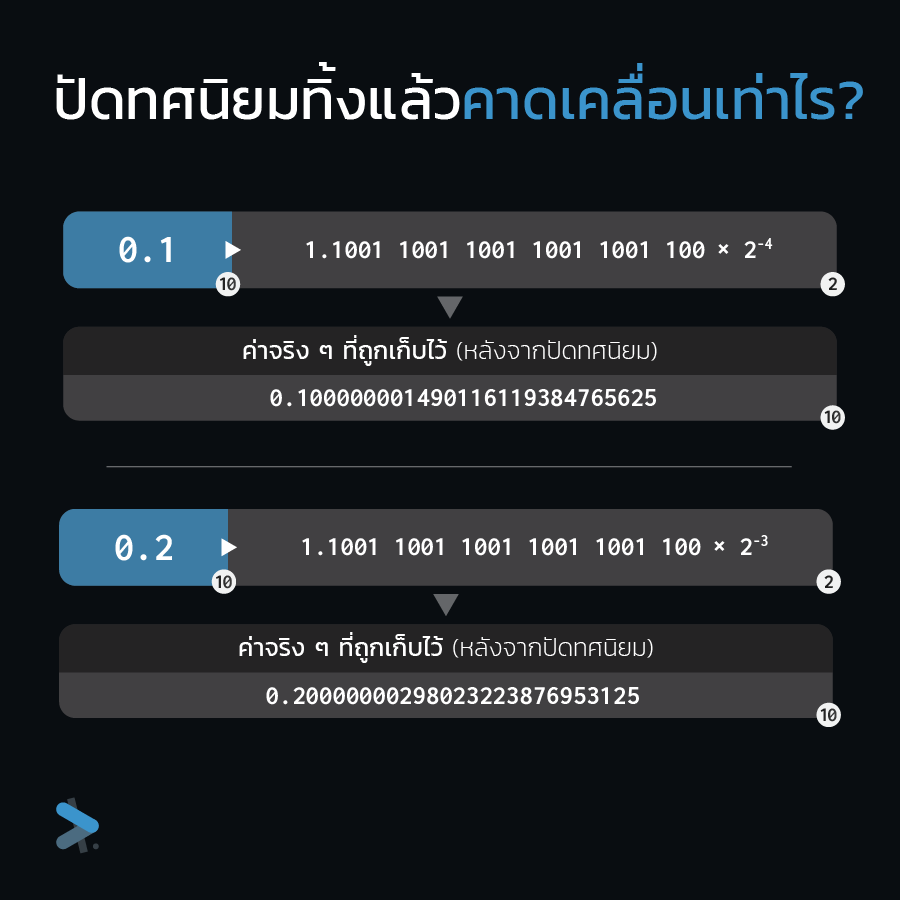

ปัดทศนิยมแล้วก็ค่าก็ต้องคลาดเคลื่อนอย่างแน่นอน เมื่อมาดูค่าจริงของ 0.1 และ 0.2 ของเราจะเริ่มเห็นได้ตั้งแต่จุดทศนิยมตำแหน่งที่ 9 เลย

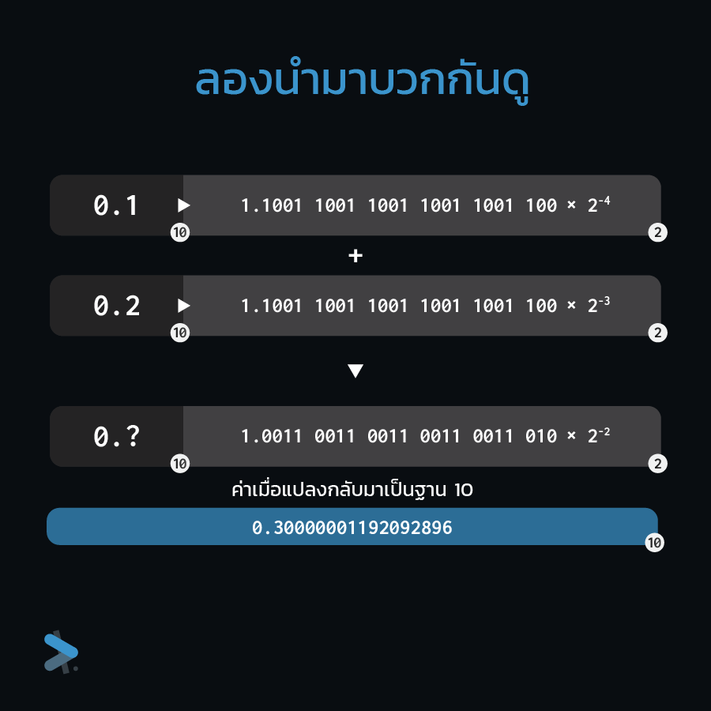

เห็นว่ามันคลาดเคลื่อนแบบนี้แล้วก็ไม่ต้องสืบเลยว่าอย่างไรมันก็บวกกันไม่ได้ 0.3 แน่นอน

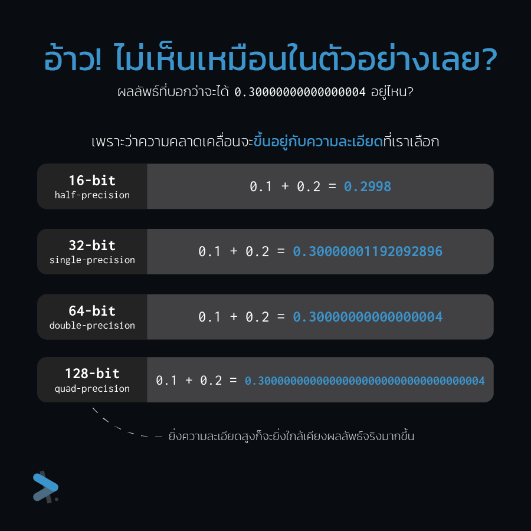

แต่ไหนว่ามันจะได้ **0.30000000000000004** ไง? ผลคลาดเคลื่อนจริงแต่ก็ยังไม่เห็นเลข 4 สักตัวเลย

เพราะว่าจากตัวอย่างที่ผ่านมาได้ใช้ <Highlight block>32-bit floating point</Highlight> หรือ <Highlight>single-precision</Highlight> (ไม่งั้นที่เขียนตัวเลขไม่พอ) ถ้าเปลี่ยนไปใช้ <Highlight block>64-bit floating point</Highlight> หรือ <Highlight>double-precision</Highlight> ก็จะเห็นลงท้ายด้วยเลข 4 ที่เราคุ้นเคย

ถ้าสังเกตดูดี ๆ จะเห็นว่ายิ่งเราใช้ความละเอียดมากเท่าไรความคลาดเคลื่อนก็จะน้อยลงไปเท่านั้น แต่ก็ไม่ได้หายไปไหนยังมีให้เห็นอยู่ดี

## จะหลีกเลี่ยงปัญหานี้อย่างไรดี?

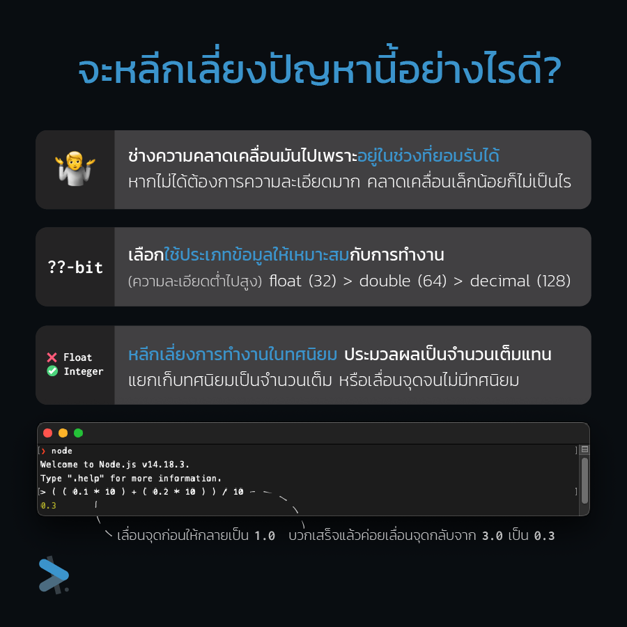

ด้วยข้อจำกัดของคอมพิวเตอร์ทำให้คิดเลขผิดแบบนี้ เราจะแก้อย่างไรดีละ?

1. <Highlight>ช่างมัน ¯\\\_(ツ)\_/¯</Highlight> ถ้าสิ่งที่เราทำอยู่ไม่ได้ต้องการความละเอียดมาก
   เช่น คำนวนตำแหน่งกราฟิก คงไม่ใช่ปัญหาอะไรที่ตำแหน่งมันเลื่อนไป 0.00000000000000004
   พิกเซล
2. <Highlight>เลือกตามความละเอียดที่ยอมรับได้</Highlight> งานบางอย่างที่ความละเอียดนั้นสำคัญมาก
   อย่างเช่นระบบการเงิน หรือระบบการเทรด ที่หากเราคำนวณการซื้อขาย Bitcoin พลาดไปแค่
   0.01 ₿ ก็เป็นความเสียหายเป็นหลักหมื่นบาทเลยที่เดียว ซึ่งเราก็ต้องเลือกว่ารับความคลาดเคลื่อนได้ถึงทศนิยมหน่วยไหน
   แต่ก็ต้องเลือกตามความเหมาะสมเพราะยิ่งความละเอียดสูงก็จะต้องใช้ที่จัดเก็บเยอะขึ้นเป็นเท่าตัวเช่นกัน
3. <Highlight>เลี่ยงการใช้งานทศนิยมไปเลย</Highlight> เพราะถ้าเราไม่ใช้มันปัญหาก็จะไม่เกิด
   ก่อนจะทำอะไรก็แปลงเป็นจำนวนเต็มก่อน เลื่อนจุดจนกลายเป็นจำนวนเต็มแล้วจำตำแหน่งทศนิยมไว้
   เมื่อเรียบร้อยแล้วก็เลื่อนจุดกลับเป็นอันเสร็จสิ้น

---

## แหล่งเรียนรู้เพิ่มเติม

อ่านถึงตรงนี้แล้วคนที่อ่านแล้วว้าว อยากรู้รายละเอียดเพิ่มก็ตามไปดูต่อด้านล่างได้ หรือถ้าใครยังเข้าไม่ถึงก็ตามไปดูต่อได้เช่นกัน

### Floating Point Numbers - Computerphile

พื้นฐานเกี่ยวกับปัญหาทศนิยมทั้งในฐาน 10 และฐาน 2 ยกตัวอย่างง่าย ๆ ให้ดูว่าทำไมถึงไม่มีที่ให้กับ 1/3 ในระบบฐาน 10 และทำไมระบบฐาน 2 ก็ไม่มีที่ให้กับ 0.1 หรือ 1/10 เช่นกัน

<YouTubeEmbed videoId="PZRI1IfStY0" />

### ทำไม 0.1 + 0.2 = 0.30000000000000004

มาตรฐาน IEEE 754 ในการเก็บเลขทศนิยม อธิบายละเอียดมาก ว่าในรูปแบบของ IEEE 754 มีหลักการอย่างไร แต่ละส่วนคืออะไร แถมมีให้เราลองเขียนโค้ดเพื่อแปลงไป/จากรูปแบบ IEEE 754 อีกด้วย

<YouTubeEmbed videoId="wPBjd-vb9eI" />

### แปลงค่าระหว่างเลขทศนิยมกับการเก็บ Floating Point แบบ IEEE 754

วิธีการแปลงจากฐาน 10 ไปเป็นฐาน 2 ในรูปแบบ IEEE 754 (พร้อมวิธีแปลงกลับ) สอนทำทีละขั้นอย่างกับจับมือทำ สองคลิปไม่เกิน 20 นาทีที่ดูแล้วเข้าใจแน่นอน

<YouTubeEmbed videoId="8afbTaA-gOQ" />

<YouTubeEmbed videoId="LXF-wcoeT0o" />

### Adding IEEE-754 Floating Point Numbers

เอาทศนิยมในรูปแบบ IEEE 754 ที่ดูวิธีการแปลงไปในคลิปที่แล้วมาบวกกัน รู้วิธีทั้งหมดแล้วก็จะลองบวก 0.1 กับ 0.2 แบบไม่ต้องให้คอมพิวเตอร์ช่วยได้แล้ว!

<YouTubeEmbed videoId="mKJiD2ZAlwM" />

สุดท้ายฝากเว็บไซต์ [0.30000000000000004.com](https://0.30000000000000004.com) ที่รวมให้เห็นว่าปัญหานี้เกิดขึ้นได้ทุกภาษา และเสนอวิธีการเลี่ยงให้กับเรา
