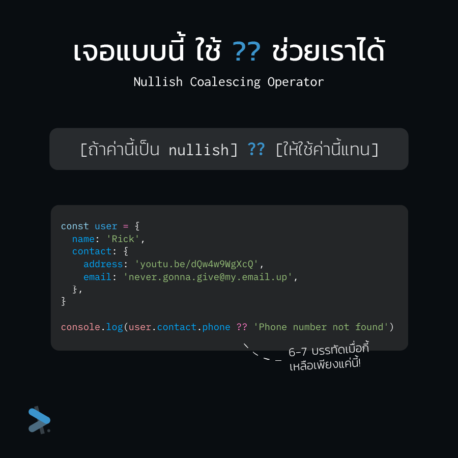
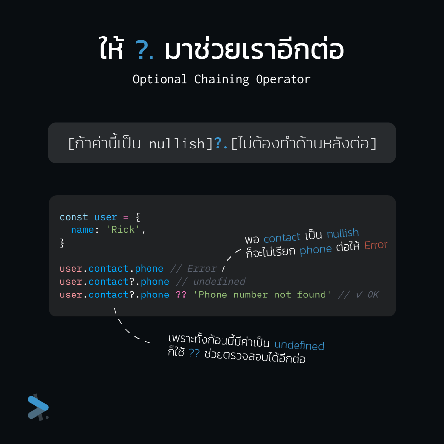
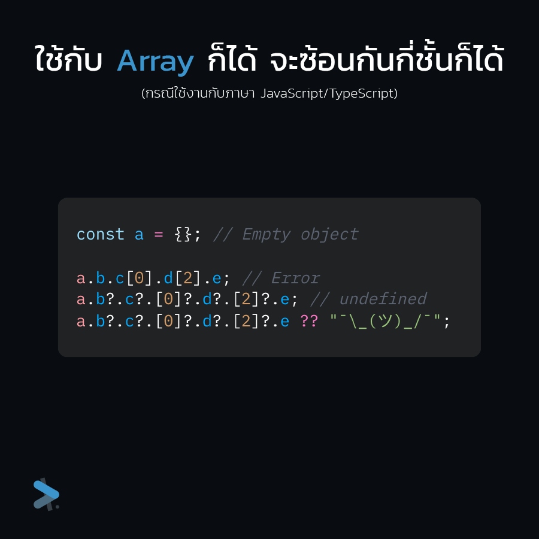

import Highlight from "@site/src/components/Highlight";

มีแต่ ??? จนรูปปกดูแทบจะเหมือนเว็บคลิกเบท แต่จริง ๆ แล้วในหลายภาษามี <Highlight>??</Highlight> กับ <Highlight>?.</Highlight> ให้เราใช้เวลาอยากจะอ่านค่าที่อยู่ด้านในลึก ๆ มาช่วยกันไม่ให้โปรแกรมเรา Error ได้ ถ้าค่านั้นมันไม่มีอยู่จริง

<!-- truncate -->

ลองสมมุติ Object ตัวหนึ่งขึ้นมา โดยที่ค่าด้านในบางตัวอาจไม่มีค่าก็ได้ เช่นในตัวอย่างนี้ที่ `user.contact.phone` อาจไม่มีค่าได้ เพราะผู้ใช้ไม่ได้กรอกมา คราวนี้ก่อนจะไปแสดงผลก็ต้องมานั่งเช็คแล้วว่ามันมีอยู่ไหม ถ้าไม่มีก็แสดงข้อความแจ้งไปว่าหาไม่พบ

การเช็คก็ไม่ยาก ใช้เพียงแค่ if/else ทั่วไป ไว้ใส่ค่าให้ตามกรณี แต่มันก็กินที่ตั้ง 6-7 บรรทัด ถ้าต้องมาเขียนแบบนี้ให้กับทุก Property ที่อยู่ใน Object ก็คงเหนื่อยแย่เลย

มาเจอปัญหาตรงนี้เราสามารถเอา <Highlight>??</Highlight> มาช่วยเราได้ เครื่องหมายคำถามสองตัวนี้เรียกว่า <Highlight block>Nullish coalescing operator</Highlight> การทำงานของมันก็คือถ้าค่าด้านซ้ายเป็น Nullish ให้ไปใช้ค่าด้านขวาแทน

<h1>
  <Highlight>[ถ้าค่านี้เป็น nullish] ?? [ให้ใช้ค่านี้แทน]</Highlight>
</h1>

แค่นี้เราก็ไม่ต้องไปเขียน if/else ให้วุ่นแล้ว (Nullish ใน JavaScript/TypeScript จะหมายถึงค่าที่เป็น `null` หรือ `undefined`)

ถัดมาดันเจอปัญหาอีกต่อหนึ่ง ถ้า `user.contact` ทั้งก้อนก็อาจไม่มีค่าได้อีกละ? ที่แก้กันไปเมื่อกี้ก็จะพังทันที เพราะเราพยายามไปอ่าน `phone` ออกมาจาก `contact` ที่มีค่าเป็น `undefined`

แบบนี้ `??` ช่วยอะไรเราไม่ได้ แล้วจะไปครอบ **try/catch** ก็ไม่ใช่เรื่อง เพราะก็จะเป็นปัญหาเดียวกับตอนเขียน if/else เพราะเราต้องทำแบบนี้ให้กับ Property ทุกตัว

ปัญหานี้ก็เอา <Highlight>?.</Highlight> หรือ <Highlight block>Optional Chaining Operator</Highlight> มาช่วยได้อีกแรง ตรงไหนที่รู้ว่าอาจไม่มีค่า ตามปกติที่เราจะใช้ **`.`** (จุด) ก็เปลี่ยนมาใช้ **`?.`** แทน ซึ่งถ้าค่านั้นเป็น Nullish ก็จะทำการ **Short-circuit** หรือหยุดการทำงานต่อ (ก็มันไม่มีค่า ถ้าฝีนทำต่อไปมันก็จะ Error) แล้วคืนค่าเป็น `undefined` ให้แทน (สำหรับ JavaScript)

พอเดาได้แล้วว่าถ้าไม่มีค่าจะกลายเป็น `undefined` คราวนี้ก็เอา `??` หรือ **Nullish coalescing operator** มาใช้ด้วยอีกต่อก็ได้

โดยสำหรับใน JavaScript เครื่องหมาย `?.` จะใช้กับการดึงค่าออกมาจาก Array ก็ได้ แล้วจะใช้ซ้อนกันกี่ชั้นก็ได้ ตรงไหนคิดว่าไม่มีก็ใส่ไปเลย

มาถึงตรงนี้เรายกตัวอย่างกันมาแต่ JavaScript ซึ่งจริง ๆ แล้ว `??` กับ `?.` ก็มีให้ใช้งานในภาษาอื่นด้วย เช่น C#, PHP, Kotlin, Objective-C และ Swift แต่อาจมีหน้าตา และชื่อเรียกที่ต่างกันออกไป

สำหรับบางภาษาเช่น Java และ Python ที่ไม่มี `??` ให้ใช้งานก็ยังพอมีแบบที่ใกล้เคียงให้ใช้ได้ แต่ก็คงไม่สั้นเท่า เช่น:

- **Java** ใช้ Ternary operator: `x != null ? x : "Not found"`
- **Python** ใช้ Conditional expression: `x if x is not None else "Not found"`
